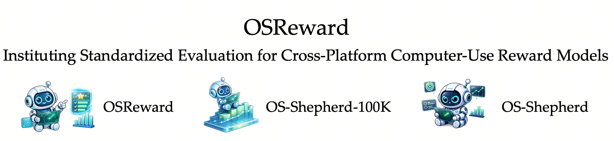

<p align="center">
  
</p>

[](https://arxiv.org/abs/2607.28609)
[](https://huggingface.co/papers/2607.28609)
[](https://os-copilot.github.io/OSReward-Home/)
[](https://huggingface.co/datasets/OS-Copilot/OSReward)
[](https://huggingface.co/datasets/OS-Copilot/OS-Shepherd-100K)
[](https://huggingface.co/collections/OS-Copilot/osreward-and-os-shepherd)

Code, benchmark and data for "OSReward: Instituting Standardized Evaluation for Cross-Platform Computer-Use Reward Models"

## 🗞️ Updates

- **2026-08**: We release the [🤗 OSReward benchmark](https://huggingface.co/datasets/OS-Copilot/OSReward), the [🤗 OS-Shepherd-100K](https://huggingface.co/datasets/OS-Copilot/OS-Shepherd-100K) corpus, and the [OS-Shepherd checkpoints](https://huggingface.co/collections/OS-Copilot/osreward-and-os-shepherd). 🔥
- **2026-07**: Initial release of our [paper](https://arxiv.org/abs/2607.28609) and [🌐 Project Page](https://os-copilot.github.io/OSReward-Home/). 🚀

## 📏 OSReward

VLM judges are now the de-facto reward signal behind CUA evaluation, data curation, and RL, yet their reliability had gone unexamined. OSReward measures it directly and fairly with human-gold, long-horizon trajectories, built from scratch so judge errors are not confounded with flaws in reused rollouts. Two derived views sharpen the probe: *OSReward-Hard* concentrates the cases current judges commonly fail, and *OSReward-Multi* scores efficiency and alignment beyond the binary verdict.

### Benchmark & Evaluation

The benchmark is live on Hugging Face ([🤗 OSReward](https://huggingface.co/datasets/OS-Copilot/OSReward)): 1,019 Full and 284 Hard trajectories with screenshots and human-gold verdicts. [`eval_pipeline/`](eval_pipeline/) is the reference evaluator: it runs any judge on the Full / Hard splits through an OpenAI-compatible or native Anthropic API and reports the strict binary metrics; see its [README](eval_pipeline/README.md) for download and usage.

### Collection Infrastructure

[`trajectory_collection/`](trajectory_collection/): the cross-platform pipelines behind the benchmark trajectories.

- 🌐 **Web** ([`webtrail/`](trajectory_collection/webtrail/)): drives agents through live and self-hosted websites.
- 🪟 **Windows** ([`windows/`](trajectory_collection/windows/)): collects desktop workflows inside a Windows 11 VM.
- 📱 **Android** ([`mobile/`](trajectory_collection/mobile/)): collects mobile app trajectories on a live Android emulator.
- 🐧 **Ubuntu**: on the way.

### Analysis & Experiments

[`benchmarking_analysis/`](benchmarking_analysis/): the OOD generalization study. It scores how VLM judges agree with the verifiers of existing benchmarks (OSWorld, WindowsAgentArena, WebArena, AndroidWorld) via a prepare → judge → analyze pipeline, producing the accuracy / bias metrics and figures.

## 📚 OS-Shepherd-100K

An open corpus of reasoning-annotated CUA trajectory judgments for training and studying reward models, built by a construction pipeline shaped by the benchmark's findings. The corpus is available on Hugging Face ([🤗 OS-Shepherd-100K](https://huggingface.co/datasets/OS-Copilot/OS-Shepherd-100K), gated access) with SFT and RL splits plus format docs; the construction pipeline is on the way.

## 🐑 OS-Shepherd (9B / 35B)

Open reward models trained on OS-Shepherd-100K. They supply low-cost, stable, and reliable reward signals for evaluation, data curation, and RL, matching commercial judges at 30–60× lower cost than the frontier. Checkpoints ([🤗 OS-Shepherd](https://huggingface.co/collections/OS-Copilot/osreward-and-os-shepherd)) together with training (SFT + RL) and inference code are on the way.

## 🚧 Open-source Roadmap

**Code**
- [x] Web trajectory collection (`trajectory_collection/webtrail/`)
- [x] Windows trajectory collection (`trajectory_collection/windows/`)
- [x] Android trajectory collection (`trajectory_collection/mobile/`)
- [ ] Ubuntu trajectory collection (`trajectory_collection/ubuntu/`)
- [x] Judge analysis on OOD benchmarks (`benchmarking_analysis/`)
- [x] OSReward evaluation harness: run any judge on OSReward / -Hard / -Multi and reproduce the leaderboard
- [ ] OS-Shepherd-100K construction pipeline (judgment synthesis + annotation tooling)
- [ ] OS-Shepherd training (SFT + RL) and inference code

**Data & models**
- [x] OSReward benchmark
- [x] OS-Shepherd-100K corpus
- [x] OS-Shepherd-9B / OS-Shepherd-35B checkpoints

## 📃 Citation

🫶 If you are interested in our work or find the repository / data / checkpoints helpful, please consider using the following citation format when referencing our paper:

```bibtex
@article{sun2026osreward,
  title={OSReward: Instituting Standardized Evaluation for Cross-Platform Computer-Use Reward Models},
  author={Qiushi Sun and Kanzhi Cheng and Yian Wang and Bowen Yang and Hang Yan and Liheng Chen and Fangzhi Xu and Zichen Ding and Nuo Chen and Jialin Cao and Xingdong Gong and Zehao Li and Kaiming Jin and Xinfeng Yuan and Zhoumianze Liu and Jingyang Gong and Zhangyue Yin and Jiahui Gao and Zhiyong Wu and Tianbao Xie and Jianbing Zhang and Ben Kao and Lingpeng Kong},
  journal={arXiv preprint arXiv:2607.28609},
  year={2026}
}
```
